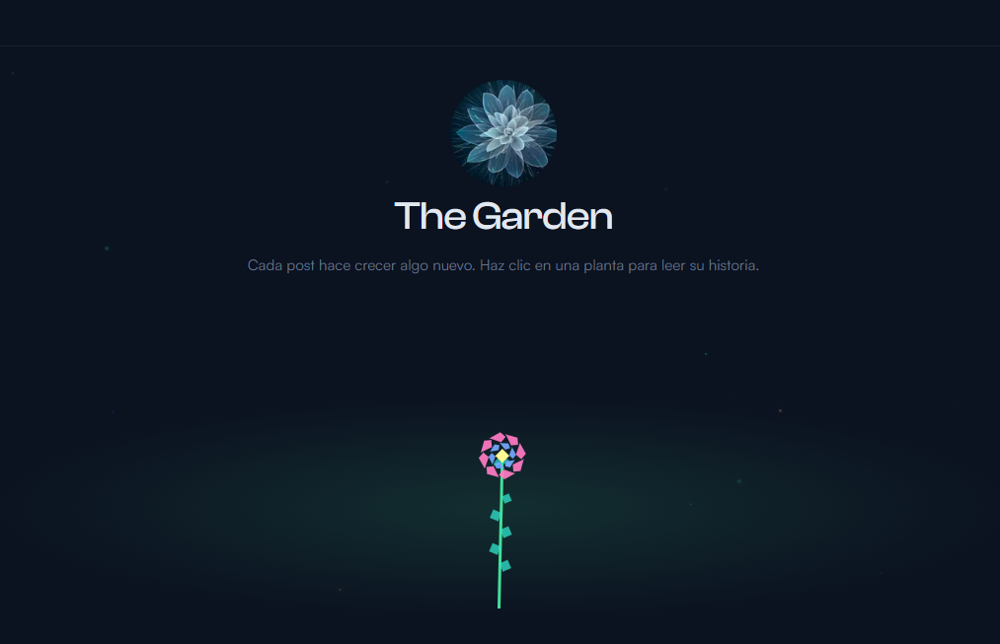
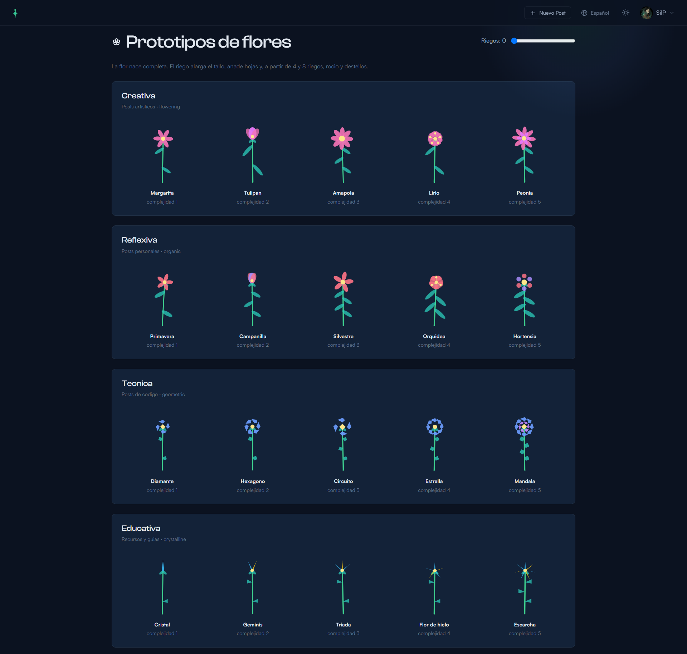

<p align="center">
  <a href="https://the-garden-blog.vercel.app">
    
  </a>
</p>

# The Garden

Plataforma de escritura colectiva. Cada post aprobado nace como una flor completa en un jardín SVG interactivo. La especie sale de un catálogo de 20 prototipos; color, altura y variación se calculan hoy con una regla determinista (familia y paleta por hash del post, altura y complejidad por longitud del texto). La clasificación semántica con Claude está preparada en el código, pero no está activa.

Mi objetivo al escalar este proyecto es crear un espacio vivo para la comunidad de programadores y personas creativas que puedan dar a conocer sus ideas y proyectos. Cuanto más crece la comunidad, más crece el jardín, como en la vida misma.

**Stack**: Next.js 16 - Supabase - GSAP - Resend - Vercel (Claude API, pendiente de activar)

**Demo**: [https://the-garden-blog.vercel.app](https://the-garden-blog.vercel.app)

---

## Concepto

No es un blog. Es un espacio vivo que crece con la comunidad. Cuando un post es aprobado, una flor completa nace en el jardin de la home. El riego no desbloquea la flor, la hace destacar.

Hay **20 prototipos** (4 familias x 5 especies). Dos posts con el mismo tipo y complejidad comparten silueta. Color, inclinacion, plano de profundidad y riegos los distinguen.

<p align="center">
  <a href="https://the-garden-blog.vercel.app">
    
  </a>
</p>

### Como se elige la flor (estado actual)

Hoy **no llama a ninguna IA**. Al moderar un post se guarda un `visual_dna` en la fila de `posts` (JSONB). El SVG no se almacena como imagen: se regenera en el cliente a partir de ese ADN, el catalogo de prototipos y el contador de riegos.

Sin `ANTHROPIC_API_KEY`, el ADN se calcula asi:

- `type` y colores: hash de `id + titulo`
- `height` y `complexity` (1-5): longitud del contenido
- `seed`: el mismo hash (inclinacion y plano de profundidad)

Claude (Haiku) ya esta cableado en `lib/claude.js` para, en el futuro, elegir familia y especie segun el sentido del texto, ademas de resumen, tags y scores de spam/toxicidad. Seguiria usando los **mismos 20 prototipos**: la IA no dibuja la flor, solo rellena el ADN. Activarlo requiere una API key de Anthropic (pago por uso). Los posts que ya tienen `visual_dna` no cambiarian al encenderla.

| Familia (`type`) | Contenido | Especies (`complexity` 1-5) |
|---|---|---|
| `geometric` | Tecnico / codigo | Diamante, Hexagono, Circuito, Estrella, Mandala |
| `organic` | Reflexivo / personal | Primavera, Campanilla, Silvestre, Orquidea, Hortensia |
| `flowering` | Creativo / artistico | Margarita, Tulipan, Amapola, Lirio, Peonia |
| `crystalline` | Educativo / recurso | Cristal, Geminis, Triada, Flor de hielo, Escarcha |

Los usuarios pueden "regar" posts que les gusten. Cada riego alarga el tallo; a umbrales fijos aparecen hojas extra, rocio y destellos (tope visual a 12 riegos).

---

## Funcionalidades

| Funcion | Descripcion |
|---------|-------------|
| Jardin SVG panoramico | Tres planos de profundidad con flores superpuestas; camara horizontal si no caben |
| Catalogo de especies | 20 prototipos fijos; la flor nace completa al aprobar |
| ADN visual | Hoy: hash + longitud del texto. Previsto: Claude elige familia y complejidad |
| Moderacion IA | Preparada (resumen, tags, ADN, spam/toxicidad). Inactiva sin API key |
| Realtime | El jardin se actualiza en vivo al aprobar posts (Supabase Realtime) |
| Sistema de riego | Un riego por usuario; alarga el tallo, suma hojas, rocio y destellos |
| Catalogo admin | `/admin/plants` para revisar prototipos y su evolucion con riegos |
| Editor rich text | TipTap con toolbar (bold, italic, links, headings, listas, codigo, citas) |
| Particulas flotantes | Fondo animado adaptativo al tema dark/light |
| Cursor glow | Resplandor que sigue al raton, visible en ambos temas |
| Dark/Light mode | Design system unificado con portfolio (CSS custom properties) |
| Navbar global | Navegacion visible en todas las paginas (home, posts, admin, auth) |
| Toast + confirmaciones | Sistema de notificaciones propio (sin dependencias externas de UI) |
| Auth completa | Email, Google, GitHub OAuth con Supabase Auth |
| Roles | Admin, Usuario, Baneado con RLS en PostgreSQL |
| i18n | Espanol e Ingles (next-intl) |
| Panel admin | Cola de moderacion con preview de plantas y aprobacion en un click |
| Notificaciones | Email al autor cuando su post es aprobado (Resend) |
| Seguridad | HTML sanitization, CSP headers, open redirect protection, Content-Type validation |

---

## Arquitectura

```
Usuario crea post
    -> status: pending
    -> API /moderate
         si hay ANTHROPIC_API_KEY -> Claude (summary, tags, visual DNA, scores)
         si no                   -> ADN por hash/longitud, resumen recortado, tag unclassified
    -> status: reviewed_by_ai
    -> visual_dna queda guardado en posts (JSONB)

Admin aprueba
    -> status: approved
    -> Supabase Realtime broadcast
    -> Jardin coloca la flor a la derecha (mas reciente) con animacion de nacimiento
    -> Email al autor via Resend
```

El jardin ordena de mas antiguo (izquierda) a mas reciente (derecha). Si hay mas flores de las que caben, la camara inicial mira el extremo derecho. Flechas, rueda o teclado recorren el resto con transicion suave. Las flores se reparten en 3 planos (fondo, medio, frente) y se solapan un poco.

---

## Seguridad

- HTML sanitization server-side y client-side con sanitize-html (whitelist de tags y atributos)
- Input sanitization (titulo, contenido, imagenes) con limites de longitud y tipo
- Validacion de IDs en todas las API routes (UUID y bigint)
- RLS en PostgreSQL: posts pendientes solo visibles para admin/autor
- Proteccion contra open redirect en flujo de login
- Content Security Policy (CSP) headers
- Proteccion contra usuarios baneados en middleware y API routes
- Content-Type validation en endpoints JSON
- Forzado de `rel="noopener noreferrer"` en enlaces de usuario
- Prompt truncation para Claude API (max 3000 chars)

---

## Desarrollo local

### 1. Clonar e instalar

```bash
git clone https://github.com/SilviaPescador/the-garden.git
cd the-garden/garden-app
pnpm install
```

### 2. Variables de entorno

Crear `garden-app/.env.local`:

```env
NEXT_PUBLIC_SUPABASE_URL=https://tu-proyecto.supabase.co
NEXT_PUBLIC_SUPABASE_ANON_KEY=tu-anon-key

# Opcional: clasificacion semantica con Claude (pago por uso).
# Sin esta clave el jardin funciona igual: el ADN se calcula por hash y longitud.
ANTHROPIC_API_KEY=sk-ant-...

# Opcional: notificaciones por email
RESEND_API_KEY=re_...

# Opcional: URL base para emails
NEXT_PUBLIC_SITE_URL=http://localhost:3000
```

### 3. Migracion de base de datos

Ejecutar en el SQL Editor de Supabase, en este orden:
1. `db/rls-policies.sql` (legacy; no usar en un proyecto ya endurecido)
2. `db/migration-garden.sql`
3. `db/migration-security-hardening.sql` (obligatorio antes de invitar usuarios)
4. `db/migration-visual-dna-backfill.sql` (permite guardar visual_dna en posts antiguos)

### 4. Ejecutar

```bash
pnpm dev
```

---

## Estructura del proyecto

```
garden-app/
  app/
    page.js                     Home con jardin SVG
    layout.js                   Root layout con particulas y cursor glow
    api/
      posts/                    CRUD de posts
      moderate/                 Moderacion (Claude si hay API key; si no, fallback)
      water/                    Sistema de riego
      posts/approve/            Aprobar/rechazar posts
    admin/
      queue/                    Cola de moderacion (preview de la especie)
      plants/                   Catalogo de prototipos y riegos
      users/                    Gestion de usuarios
    posts/[id]/                 Detalle de post
    (auth)/                     Login, registro, banned
  components/
    garden/
      Garden.js                 Viewport panoramico, 3 planos, Realtime
      Plant.js                  Flor individual con GSAP
      PlantGenerator.js         Dibuja la especie + evolucion por riego
      flowerSpecies.js          Catalogo de 20 prototipos
      PlantPreview.js           Miniatura SVG (cola y catalogo admin)
      svgElements.js            Renderer SVG compartido
      PlantTooltip.js           Tooltip en hover
      gardenUtils.js            Layout, planos, PRNG, DNA por defecto
    Particles.js                Particulas flotantes (fireflies)
    CursorGlow.js               Resplandor que sigue al cursor
    Icons.js                    Sistema de iconos SVG
    ThemeToggle.js              Dark/light mode
    WaterButton.js              Boton de riego con persistencia de estado
    Navbar.js                   Navegacion global (logo SVG, acciones)
    ToastProvider.js            Toast + ConfirmDialog (reemplaza SweetAlert2)
    RichEditor.js               Editor WYSIWYG con TipTap
    layout.js                   Shell del sitio (header, footer)
    postArticle.js              Tarjeta de post con renderizado HTML
    ...
  lib/
    claude.js                   Cliente Claude API (inactivo sin ANTHROPIC_API_KEY)
    email.js                    Notificaciones Resend
    validation.js               Sanitizacion y validacion de inputs
    supabase/                   Clientes Supabase (client, server, middleware)
  styles/
    tokens.css                  Design tokens (colores, tipografia, spacing)
    global.css                  Estilos base, particulas, cursor glow, utilidades
    garden.css                  Estilos del jardin
  db/
    migration-garden.sql        Migracion para The Garden
    migration-visual-dna-backfill.sql  Permite persistir visual_dna en posts legacy
```

---

## Stack

| Categoria | Tecnologia |
|-----------|------------|
| Framework | Next.js 16 (App Router) |
| Frontend | React 19, CSS Custom Properties, GSAP, TipTap |
| Backend | API Routes de Next.js |
| Base de datos | Supabase (PostgreSQL + Realtime) |
| Auth | Supabase Auth (Email, Google, GitHub) |
| IA | Claude API (Haiku), pendiente de activar |
| Email | Resend |
| Hosting | Vercel |
| i18n | next-intl (ES/EN) |

---

## Autora

**Silvia Pescador** - [@SilviaPescador](https://github.com/SilviaPescador)
